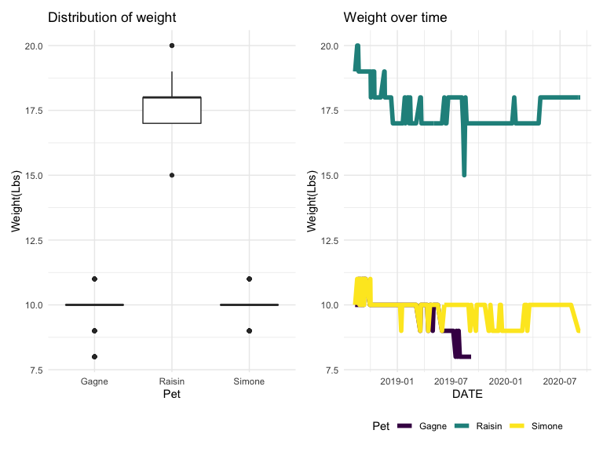

Midterm
================
Zihan Yu
2020-10-25

``` r
library(tidyverse)
```

    ## ── Attaching packages ──────────────────────────────────────────────────────────────────── tidyverse 1.3.0 ──

    ## ✓ ggplot2 3.3.2     ✓ purrr   0.3.4
    ## ✓ tibble  3.0.3     ✓ dplyr   1.0.2
    ## ✓ tidyr   1.1.2     ✓ stringr 1.4.0
    ## ✓ readr   1.3.1     ✓ forcats 0.5.0

    ## ── Conflicts ─────────────────────────────────────────────────────────────────────── tidyverse_conflicts() ──
    ## x dplyr::filter() masks stats::filter()
    ## x dplyr::lag()    masks stats::lag()

``` r
library(ggridges)
library(patchwork)
library(readxl)

knitr::opts_chunk$set(
    echo = TRUE,
    warning = FALSE,
    fig.width = 8, 
  fig.height = 6,
  out.width = "90%"
)

theme_set(theme_minimal() + theme(legend.position = "bottom"))

options(
  ggplot2.continuous.colour = "viridis",
  ggplot2.continuous.fill = "viridis"
)

scale_colour_discrete = scale_colour_viridis_d
scale_fill_discrete = scale_fill_viridis_d
```

## Data

The data set contains weight records of three pet dogs – Simone, Gagne,
and Raisin. It has 6 variables: DATE, Raisin, Simone, Gagne, std and
note, the DATE contains the date when the weight is recorded, the second
to the fourth columns contains the weight of the dogs in Lbs and Oz,
each column has two values. The std columns contains the weight of a
standard object, it also has two values in Lbs and Oz.

First, reading the data from excel, take a glimpse of the dataset.

``` r
dat <- read_excel("dogweights_07sept2020.xlsx", skip = 1)
```

    ## New names:
    ## * `` -> ...6

``` r
colnames(dat)[6] <- "note"
head(dat)
```

    ## # A tibble: 6 x 6
    ##   DATE  Raisin Simone Gagne std     note                                     
    ##   <chr> <chr>  <chr>  <chr> <chr>   <chr>                                    
    ## 1 43324 19 12  10 14  10 10 <NA>    <NA>                                     
    ## 2 43331 20 03  11 02  10 12 20 15.8 <NA>                                     
    ## 3 43334 20 04  11 04  10 13 20 15.6 <NA>                                     
    ## 4 43336 19 13  11 04  11 01 20 15.6 <NA>                                     
    ## 5 43339 19 06  10 08  10 06 20 15.6 Right after leaving for 3 days at Weber's
    ## 6 43340 <NA>   <NA>   <NA>  <NA>    <NA>

The data is not in tidy format, since the DATE is ircorrectly formated,
and the 2-4 columns have multiple values, so we should do some data
cleaning before exploring. The notes only occured in a few days, too
many NA values occured in this column, it takes up too many spaces, we
can extract the note into a new table.

First, take use of the as.Date() function, convert the DATE from
character to Date type.

``` r
dat$DATE <- as.Date(as.numeric(dat$DATE), origin = "1899-12-30")
head(dat)
```

    ## # A tibble: 6 x 6
    ##   DATE       Raisin Simone Gagne std     note                                   
    ##   <date>     <chr>  <chr>  <chr> <chr>   <chr>                                  
    ## 1 2018-08-12 19 12  10 14  10 10 <NA>    <NA>                                   
    ## 2 2018-08-19 20 03  11 02  10 12 20 15.8 <NA>                                   
    ## 3 2018-08-22 20 04  11 04  10 13 20 15.6 <NA>                                   
    ## 4 2018-08-24 19 13  11 04  11 01 20 15.6 <NA>                                   
    ## 5 2018-08-27 19 06  10 08  10 06 20 15.6 Right after leaving for 3 days at Webe…
    ## 6 2018-08-28 <NA>   <NA>   <NA>  <NA>    <NA>

The weight contains two values in different unit, here I will only keep
the weight in Lbs.

``` r
getWeight <- function(x){
  if(is.na(x)){
    return(NA)
  }
  tokens <- unlist(strsplit(x, " "))
  as.numeric(tokens[1])
}
dat$Raisin <- sapply(dat$Raisin, getWeight)
dat$Simone <- sapply(dat$Simone, getWeight)
dat$Gagne <- sapply(dat$Gagne, getWeight)
dat$std <- sapply(dat$std, getWeight)
```

Get the summary statisitc of the cleaned dataset.

``` r
summary(dat)
```

    ##       DATE                Raisin            Simone           Gagne       
    ##  Min.   :2018-08-12   Min.   :   7.00   Min.   : 9.000   Min.   : 8.000  
    ##  1st Qu.:2018-11-03   1st Qu.:  17.00   1st Qu.:10.000   1st Qu.:10.000  
    ##  Median :2019-05-01   Median :  18.00   Median :10.000   Median :10.000  
    ##  Mean   :2019-06-25   Mean   :  35.45   Mean   : 9.948   Mean   : 9.775  
    ##  3rd Qu.:2020-02-03   3rd Qu.:  18.00   3rd Qu.:10.000   3rd Qu.:10.000  
    ##  Max.   :2020-09-07   Max.   :1810.00   Max.   :11.000   Max.   :11.000  
    ##  NA's   :1            NA's   :3         NA's   :12       NA's   :85      
    ##       std          note          
    ##  Min.   :20    Length:205        
    ##  1st Qu.:20    Class :character  
    ##  Median :20    Mode  :character  
    ##  Mean   :20                      
    ##  3rd Qu.:20                      
    ##  Max.   :20                      
    ##  NA's   :165

There are some outliers in the Raisin column, some values are extreamly
larger, higher than 1800, and the minimum value is 7, which is
impoissible. If we look up the original table, we can found the correct
value is should be 17 and 18.

Fix the data by repalce the wrong value with the correct weight.

``` r
dat$Raisin[dat$Raisin==7] <- 15
dat$Raisin[dat$Raisin>1800] <- 18
```

Check again, now all the weights are in a valid range.

``` r
summary(dat)
```

    ##       DATE                Raisin          Simone           Gagne       
    ##  Min.   :2018-08-12   Min.   :15.00   Min.   : 9.000   Min.   : 8.000  
    ##  1st Qu.:2018-11-03   1st Qu.:17.00   1st Qu.:10.000   1st Qu.:10.000  
    ##  Median :2019-05-01   Median :18.00   Median :10.000   Median :10.000  
    ##  Mean   :2019-06-25   Mean   :17.78   Mean   : 9.948   Mean   : 9.775  
    ##  3rd Qu.:2020-02-03   3rd Qu.:18.00   3rd Qu.:10.000   3rd Qu.:10.000  
    ##  Max.   :2020-09-07   Max.   :20.00   Max.   :11.000   Max.   :11.000  
    ##  NA's   :1            NA's   :3       NA's   :12       NA's   :85      
    ##       std          note          
    ##  Min.   :20    Length:205        
    ##  1st Qu.:20    Class :character  
    ##  Median :20    Mode  :character  
    ##  Mean   :20                      
    ##  3rd Qu.:20                      
    ##  Max.   :20                      
    ##  NA's   :165

Besides, the dataset is in wide format, yuu can recognize data in wide
format by the fact that columns generally represent groups, as in our
data, Raisin, Simone, Gagne is a group, all the three columns are the
weights of a group, so it is in wide foratm we should convert it to long
format, we can take use of the gather() in function in the tidyverse
packages.

``` r
dat <- dat %>% gather(key=Pet, value=Weight, Raisin:Gagne)
```

Create two dataset, one contains the date and weight, the other contains
the date the note. Save the data into csv. In the first dataset, remove
any row contains the NA value.

``` r
dat1 <- dat[, c(1,4,5)]
dat1 <- na.omit(dat1)
write.csv(dat1, "dat1.csv", row.names = F)
dat2 <- dat[, c(1, 3)]
dat2 <- na.omit(dat2)
write.csv(dat2, "dat2.csv", row.names = F)
```

## EDA

``` r
ndate <- length(unique(dat$DATE))
df <- dat1 %>%
  group_by(Pet) %>% 
  summarise(Obs=n(), averageWeight=mean(Weight), sdWeight=sd(Weight)) 
```

    ## `summarise()` ungrouping output (override with `.groups` argument)

``` r
knitr::kable(df, digits = 2)
```

| Pet    | Obs | averageWeight | sdWeight |
| :----- | --: | ------------: | -------: |
| Gagne  | 119 |          9.77 |     0.73 |
| Raisin | 201 |         17.78 |     0.76 |
| Simone | 192 |          9.95 |     0.48 |

There are 205 unique dates in the dataset. There are 119 records for
Gagne, 201 records for Raisin, 192 records for Simone. The average
weight of Gagne is 9.77 lbs, the average weight of of Raisin is 17.8
lbs, the average weight os Simone is 9.95 lbs, so the average weight of
Gagne is quite similar to the average weight of Simone, the average
weight of Raisin is almost 2 times of the weight of Gagne. The standard
deviation of the weight for Gagne is 0.730, the standard deviation of
the weight fot Raisin is 0.763, the standard deviation of the weight for
Simone is 0.477. Simone has the smallest standard deviation, so Simone
has the smallest varitions in weight.

## Visualization

``` r
p1 <- dat1 %>% ggplot(aes(y=Weight, x=Pet)) + geom_boxplot() +
  labs(y="Weight(Lbs)", title="Distribution of weight")
p2 <- dat1 %>% ggplot(aes(x=DATE, y=Weight, colour=Pet)) + geom_line(size=2) +
  labs(y="Weight(Lbs)", title="Weight over time")
p1 + p2
```



Gagae and Simone have similar weight, Raisin has the highest weight. The
weight of Gagne decreased in 2019-07, the weight of Raisin has a decline
before 2019-01.
